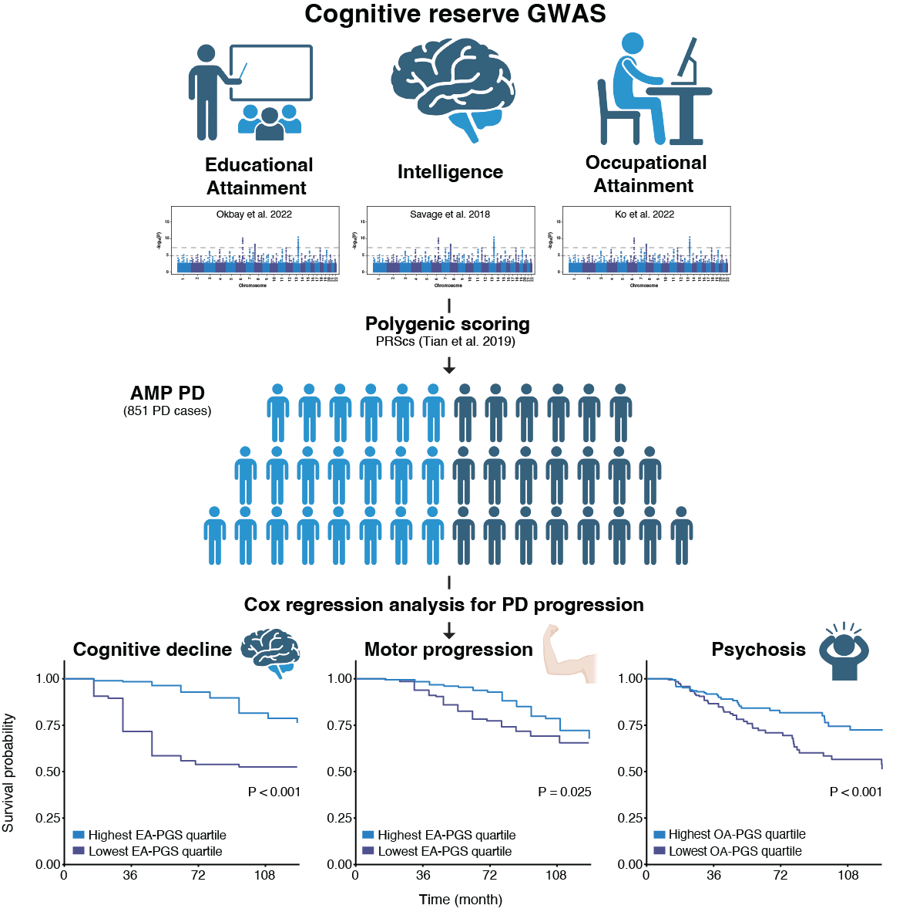

# PRS model of cognitive reserve in progression of Parkinson’s disease 
Huh, Y. E., Jang, B., Jung, S.-H., Kim, D., Raj, T. & Won, H.-H. (2025) Protective effects of genetic proxies of cognitive reserve in Parkinson’s disease: a longitudinal multi-cohort study
---

> This repository includes [PRS model](./PRS_model/).

## Description

> To evaluate the utility of polygenic scores (PGSs) for cognitive reserve proxies, including intelligence (INT), educational attainment (EA), and occupational attainment (OA), in predicting the clinical progression of Parkinson’s disease. Genetic proxies of cognitive reserve are associated with a reduced risk of cognitive decline, motor progression, and development of psychosis in Parkinson’s disease. These findings may enhance our understanding of individual differences in resilience in progression of Parkinson’s disease.

 

## Data source (GWAS summary statistics) - GRCh37/hg19
- **Educational attainment**: [Okbay et al., 2022, Nature Genetics](https://www.nature.com/articles/s41588-022-01016-z) 
- **Occupational attainment**: [Ko et al., 2021, Brain](https://doi.org/10.1093/brain/awab351) 
- **Intelligence**: [Savage et al., 2018, Nature Genetics](https://www.nature.com/articles/s41588-018-0152-6) 
- **Parkinson's disease**: [FinnGen Release 10 + UKBB](https://www.finngen.fi/en/access_results) 
- **Alzheimer's disease**: [Kunkle et al., 2019, Nature Genetics](https://www.nature.com/articles/s41588-019-0358-2) 

## PGS Construction
 
- **Bayesian Prediction Method:**  
  We used [**PRS-CS**](https://github.com/getian107/PRScs) to infer the posterior mean effect size of variants, leveraging the **1000 Genomes Project (phase 3 EUR)** as the external linkage disequilibrium (LD) reference panel.
  

 
|    PGS  | Weighted variants |
| :-----: | :-------------: |
| EA-PGS  | 1,088,966       |
| OA-PGS  | 1,062,254       |
| INT-PGS | 1,092,469       |
| PD-PGS  | 1,097,109       |
| AD-PGS  | 1,096,588       |

- **Computation:**  
  Individual PGSs were calculated as a weighted sum of risk alleles using beta coefficients from PRS-CS. This was implemented using [**PLINK v1.90**](https://www.cog-genomics.org/plink/) with the `–score` command.

## Authors

> Contributors names and contact info

- §Young Eun Huh (ye.huh@chamc.co.kr)

- §Beomjin Jang (beomjin.jang@skku.edu)

- §Sang-Hyuk Jung (sh.jung@kangwon.ac.kr)

- Dokyoon Kim (dokyoon.kim@pennmedicine.upenn.edu)

- *Towfique Raj (towfique.raj@mssm.edu)

- *Hong-Hee Won (wonhh@skku.edu)

§These authors contributed equally to this work as co-first authors.

*These authors contributed equally to this work as corresponding authors.

## Acknowledgments

* [AMP PD](https://amp-pd.org/)
* [PRScs](https://github.com/getian107/PRScs)

